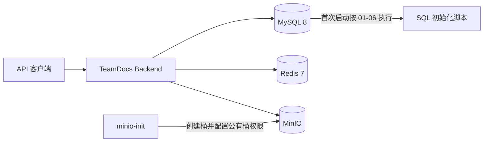
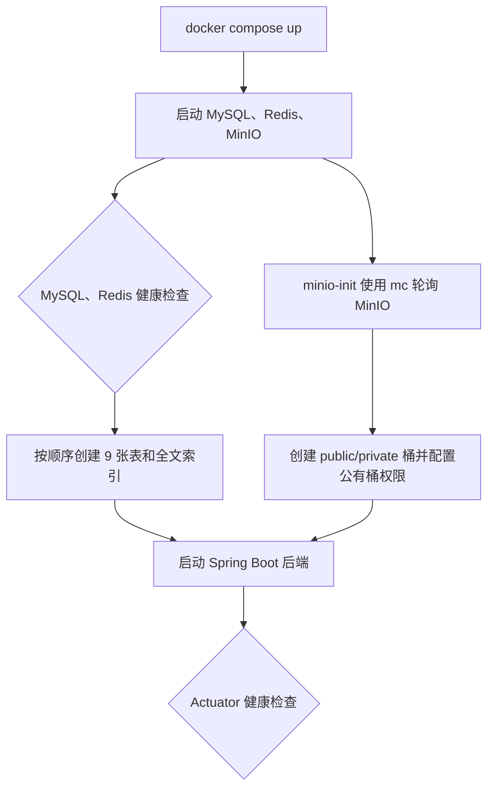

# TeamDocs

TeamDocs 是一个面向小型团队的文档协作平台，提供空间与成员权限、文件夹和文档管理、标签检索、评论、操作日志、Redis 缓存与限流，以及基于 file-viewer 的文档在线预览。

当前仓库包含完整交付的后端（Spring Boot）与前端（Vue 3）。微服务、Elasticsearch、Yjs 和 RAG/Agent 不在本阶段范围内。

## 核心能力

- JWT 无 Session 认证，密码使用 BCrypt 加密，Redis 撤销名单支持当前 Token 注销
- OWNER / ADMIN / MEMBER 三级空间权限，使用 Spring AOP 统一校验
- 文档上传、下载、移动、重命名、软删除、回收站与彻底删除
- MinIO 私有桶存储和一小时有效的预签名下载 URL
- 文档在线预览：`inline` 预签名 URL + file-viewer 渲染图片、PDF、Word、表格、演示文稿与 OFD
- 标签关联、MySQL FULLTEXT + ngram 元数据搜索
- 扁平评论与回复关系，删除后保留占位
- AOP 操作日志，日志写入失败不影响主业务
- Redis Cache Aside 空间缓存、Lua 登录限流、ZSet 最近浏览
- 前端飞书风格工作区：文档预览、标签管理、最近浏览、活动流与键盘可达性

## 技术栈

### 后端

- Web：Spring Boot 3.5、Spring MVC、Validation
- 认证与权限：Spring Security、JWT、Spring AOP
- 数据访问：MyBatis-Plus、MySQL 8
- 缓存：Spring Data Redis、Redis 7、Lua
- 文件存储：MinIO
- 测试与部署：JUnit 5、Mockito、Docker Compose

### 前端

- Vue 3 + Vite 6 + Pinia + Vue Router
- Element Plus + lucide-vue-next
- @file-viewer 系列渲染器（图片/文本/PDF/Word/表格/演示文稿/OFD）

## 架构



请求先经过 JWT Filter，再进入 Controller、Service 和 Mapper。空间内业务由 `@RequireSpaceRole` 切面校验成员角色；MySQL 保存业务元数据，Redis 保存缓存、限流窗口、Token 撤销名单和最近浏览，MinIO 保存文件本体。

## 一键启动

### 前置条件

- Windows/macOS 已启动 Docker Desktop，或 Linux 已启动 Docker Engine
- Docker Compose v2 可用
- 默认宿主机端口 `18080`、`19000`、`19001` 未被占用

### 1. 准备环境变量

PowerShell：

```powershell
Copy-Item .env.docker.example .env.docker
```

CMD：

```cmd
copy /Y .env.docker.example .env.docker
```

Linux/macOS：

```bash
cp .env.docker.example .env.docker
```

至少替换 `.env.docker` 中的数据库、Redis、JWT 和 MinIO 密钥。JWT 密钥不得少于 32 字节。`MINIO_CORS_ALLOWED_ORIGIN` 必须填写前端实际访问来源（协议、域名和端口），本地 Vite 默认是 `http://localhost:5173`。

不要删除 `TEAMDOCS_DOCKER_ENV`，它用于阻止 Compose 误读原生启动使用的根目录 `.env`。如果密码含有 `$`，必须在 `.env.docker` 中用单引号包住，例如 `DB_PASSWORD='a$password'`，否则 Compose 会把 `$password` 当成变量引用。Docker 命令显式读取这个文件，不会误用原生启动后端所用的 `.env` 或其中的远程 Redis/MinIO 地址。

### 2. 启动完整环境

```shell
docker compose --env-file .env.docker -f docker-compose.dev.yml up -d --build
docker compose --env-file .env.docker -f docker-compose.dev.yml ps -a
```

首次启动流程：



查看后端日志：

```shell
docker compose --env-file .env.docker -f docker-compose.dev.yml logs -f backend
```

本地入口：API `http://localhost:18080`，Backend Health `http://localhost:18080/actuator/health`，MinIO API `http://localhost:19000`，MinIO Console `http://localhost:19001`。MySQL 和 Redis 只在 Compose 内部网络开放，不占用宿主机端口。

### 3. 停止或重置

```shell
docker compose --env-file .env.docker -f docker-compose.dev.yml down
```

删除容器和全部数据卷，下一次启动会重新执行 SQL：

```shell
docker compose --env-file .env.docker -f docker-compose.dev.yml down -v
```

`down -v` 会永久删除本地 MySQL、Redis 和 MinIO 数据，只能用于明确需要重置的开发环境。

## 环境变量

- `BACKEND_PORT`：后端宿主机端口，Docker 模板使用 `18080`
- `TEAMDOCS_DOCKER_ENV`：Docker 专用环境文件标记，缺失时 Compose 拒绝启动
- `BIND_ADDRESS`：宿主机绑定地址，开发环境默认 `127.0.0.1`
- `DB_NAME` / `DB_PASSWORD`：MySQL 数据库名和 root 密码
- `REDIS_PASSWORD`：Redis 密码
- `JWT_SECRET`：JWT HMAC 密钥，至少 32 字节
- `MINIO_API_PORT` / `MINIO_CONSOLE_PORT`：MinIO API 与控制台宿主机端口
- `MINIO_PUBLIC_ENDPOINT`：必填，返回给客户端的文件访问地址，Docker 模板使用 `http://localhost:19000`
- `MINIO_CORS_ALLOWED_ORIGIN`：必填，允许读取预签名资源的前端来源，必须是精确的 `scheme://host[:port]`
- `MINIO_REGION`：MinIO 区域，默认 `us-east-1`，后端与服务端必须一致
- `MINIO_ACCESS_KEY` / `MINIO_SECRET_KEY`：MinIO 管理账号和密码
- `MINIO_BUCKET_PUBLIC` / `MINIO_BUCKET_PRIVATE`：公有桶和私有桶名称

`DB_HOST`、`DB_USERNAME`、`REDIS_HOST` 和 `MINIO_ENDPOINT` 主要用于不通过 Compose 直接启动后端。Compose 会把它们设置成容器网络内的服务地址，并使用 MySQL root 用户。

Compose 内部使用 `http://minio:9000` 连接 MinIO，但下载链接必须使用客户端能访问的 `MINIO_PUBLIC_ENDPOINT`。MinIO 服务通过 `MINIO_API_CORS_ALLOW_ORIGIN` 仅允许配置的前端来源跨域访问；修改来源后，执行 `docker compose --env-file .env.docker -f docker-compose.dev.yml up -d --force-recreate minio` 重新应用。部署到服务器时应把 `BIND_ADDRESS` 改为 `0.0.0.0`，把公开地址改成公网 IP 或域名，例如 `http://your-server:9000`，并开放对应端口。

## API 约定

注册、登录和健康检查允许匿名访问，其余接口需要请求头：

```text
Authorization: Bearer <token>
```

项目的业务异常统一返回 HTTP 200。真正的业务结果看响应体：

```json
{
  "code": 1,
  "msg": "success",
  "data": null
}
```

- `code = 1`：业务成功
- `code = 0`：业务失败，原因见 `msg`
- JWT 缺失、格式错误、已注销或失效：HTTP 401，并返回 `code = 0` 的统一 JSON

主要路由：

- 用户：`POST /user/register`、`POST /user/login`、`POST /user/logout`、`GET /user/info`
- 最近浏览：`GET /user/recent-documents`
- 空间与成员：`/space`、`/space/{id}/members`
- 文件夹：`/spaces/{spaceId}/folders`
- 文档：`/spaces/{spaceId}/documents`，预览：`/spaces/{spaceId}/documents/{documentId}/preview`
- 标签：`/spaces/{spaceId}/tags` 及文档标签关联接口
- 评论：`/spaces/{spaceId}/documents/{documentId}/comments`

文档上传使用 `multipart/form-data`，文件字段名是 `file`；根目录使用 `folderId=0`。发表评论时 `replyToId` 可为空。

文档列表、回收站、搜索、按标签筛选和评论列表支持数据库分页。查询参数 `current` 默认 `1`，`size` 默认 `20`、最大 `100`，响应中的 `data` 结构为：

```json
{
  "records": [],
  "total": 0,
  "current": 1,
  "size": 20,
  "pages": 0
}
```

## API 冒烟测试

下面的 PowerShell 流程会创建临时账号、空间和小文本文件，动态获取 ID，不依赖开发数据库中的旧数据。脚本不会打印 JWT 或预签名 URL。

```powershell
$baseUrl = 'http://localhost:18080'
$stamp = [DateTimeOffset]::UtcNow.ToUnixTimeSeconds()
$username = "demo$stamp"
$password = 'password123'
$spaceName = "smoke-$stamp"

$accountBody = @{ username = $username; password = $password } | ConvertTo-Json
$register = Invoke-RestMethod -Method Post -Uri "$baseUrl/user/register" -ContentType 'application/json' -Body $accountBody
if ($register.code -ne 1) { throw $register.msg }

$login = Invoke-RestMethod -Method Post -Uri "$baseUrl/user/login" -ContentType 'application/json' -Body $accountBody
if ($login.code -ne 1) { throw $login.msg }
$headers = @{ Authorization = "Bearer $($login.data)" }

$spaceBody = @{ name = $spaceName; description = 'Compose smoke test' } | ConvertTo-Json
$createSpace = Invoke-RestMethod -Method Post -Uri "$baseUrl/space" -Headers $headers -ContentType 'application/json' -Body $spaceBody
if ($createSpace.code -ne 1) { throw $createSpace.msg }

$spaces = Invoke-RestMethod -Method Get -Uri "$baseUrl/space/list" -Headers $headers
$spaceId = ($spaces.data | Where-Object name -eq $spaceName | Select-Object -First 1).id
if (-not $spaceId) { throw '未找到刚创建的空间' }

$sourceFile = Join-Path $env:TEMP "teamdocs-$stamp.txt"
$downloadedFile = Join-Path $env:TEMP "teamdocs-$stamp-downloaded.txt"
Set-Content -Path $sourceFile -Value 'TeamDocs Compose smoke test' -Encoding UTF8

$uploadJson = & curl.exe --silent --request POST "$baseUrl/spaces/$spaceId/documents/upload?folderId=0" --header "Authorization: Bearer $($login.data)" --form "file=@$sourceFile"
$upload = $uploadJson | ConvertFrom-Json
if ($upload.code -ne 1) { throw $upload.msg }

$documents = Invoke-RestMethod -Method Get -Uri "$baseUrl/spaces/$spaceId/documents?folderId=0" -Headers $headers
$documentId = ($documents.data.records | Where-Object name -eq (Split-Path $sourceFile -Leaf) | Select-Object -First 1).id
if (-not $documentId) { throw '未找到刚上传的文档' }

$download = Invoke-RestMethod -Method Get -Uri "$baseUrl/spaces/$spaceId/documents/$documentId/download" -Headers $headers
if ($download.code -ne 1) { throw $download.msg }
Invoke-WebRequest -Uri $download.data -OutFile $downloadedFile

Start-Sleep -Seconds 1
$recent = Invoke-RestMethod -Method Get -Uri "$baseUrl/user/recent-documents" -Headers $headers
if ($recent.code -ne 1) { throw $recent.msg }

$logout = Invoke-RestMethod -Method Post -Uri "$baseUrl/user/logout" -Headers $headers
if ($logout.code -ne 1) { throw $logout.msg }

[pscustomobject]@{
    User = $username
    SpaceId = $spaceId
    DocumentId = $documentId
    RecentCount = @($recent.data).Count
    Downloaded = Test-Path $downloadedFile
}
```

## 本地开发与测试

在 `teamdocs-backend` 下执行：

PowerShell：

```powershell
.\mvnw.cmd test
.\mvnw.cmd spring-boot:run
```

CMD：

```cmd
mvnw.cmd test
mvnw.cmd spring-boot:run
```

Linux/macOS：

```bash
sh ./mvnw test
sh ./mvnw spring-boot:run
```

运行后端前需保证 MySQL、Redis 和 MinIO 可访问，并把 `.env.example` 中的变量配置到仓库根目录 `.env` 或操作系统环境变量。

## 常见问题

- **端口被占用**：修改 `.env.docker` 中对应的宿主机端口；容器内部端口无需修改。
- **提示 `TEAMDOCS_DOCKER_ENV` 缺失**：命令遗漏了 `--env-file .env.docker`，Compose 已阻止误用根目录 `.env`。
- **修改 SQL 后没有生效**：初始化脚本只在 MySQL 数据卷为空时执行。确认不需要旧数据后使用 `down -v` 重建。
- **下载 URL 中出现 `minio:9000`**：检查后端是否设置了 `MINIO_PUBLIC_ENDPOINT`，并重新构建镜像。
- **下载 URL 无法从浏览器访问**：公开地址必须是浏览器可达的 IP 或域名，且 MinIO API 端口已放行。
- **在线预览提示跨域错误**：确认 `MINIO_CORS_ALLOWED_ORIGIN` 与浏览器地址栏中的前端来源完全一致，并强制重建 `minio` 容器。
- **Backend 状态为 unhealthy**：访问 `/actuator/health`，并查看 Backend、MySQL 和 Redis 日志。
- **接口 HTTP 200 但操作失败**：检查响应体的 `code` 和 `msg`，不要只看 HTTP 状态码。
- **Docker 无法连接 daemon**：Windows/macOS 启动 Docker Desktop；Linux 启动 Docker 服务。
