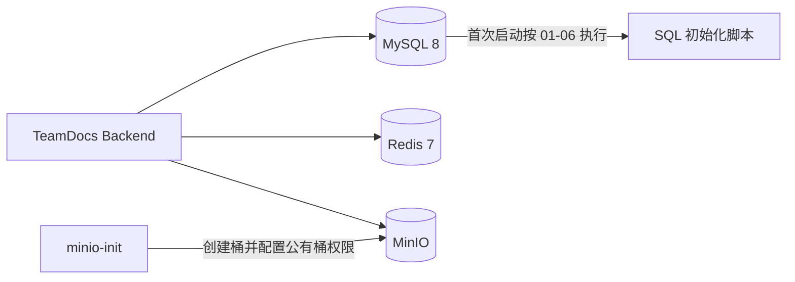

# TeamDocs

<div align="center">

[](https://github.com/spring-projects/spring-boot)
[](https://github.com/spring-projects/spring-security)
[](https://github.com/spring-projects/spring-framework)

[](https://github.com/baomidou/mybatis-plus)
[](https://github.com/mysql/mysql-server)
[](https://github.com/redis/redis)
[](https://github.com/minio/minio)

[](https://github.com/jwtk/jjwt)
[](https://github.com/xiaoymin/knife4j)
[](https://github.com/docker/compose)

</div>

TeamDocs 是一个面向小型团队的文档协作平台，提供空间与成员权限、文件夹和文档管理、标签检索、评论、操作日志、Redis 缓存与限流，以及基于 file-viewer 的文档在线预览。

当前仓库包含完整交付的后端（Spring Boot）与前端（Vue 3）。微服务、Elasticsearch、Yjs 和 RAG/Agent 不在本阶段范围内。

## 核心能力

- JWT 无 Session 认证，密码使用 BCrypt 加密，Redis 撤销名单支持当前 Token 注销
- OWNER / ADMIN / MEMBER 三级空间权限，使用 Spring AOP 统一校验
- 文档上传、下载、移动、重命名、软删除、回收站与彻底删除
- MinIO 私有桶存储和一小时有效的预签名 URL，下载走 `attachment`、在线预览走 `inline`
- 文档在线预览：file-viewer 渲染图片、PDF、Word、表格、演示文稿与 OFD
- 标签关联、MySQL FULLTEXT + ngram 元数据搜索
- 扁平评论与回复关系，删除后保留占位
- AOP 操作日志，日志写入失败不影响主业务；活动流聚合展示
- Redis Cache Aside 空间缓存、Lua 登录限流、ZSet 最近浏览
- 前端飞书风格工作区：标签管理、最近浏览、活动流与键盘可达性

## 技术栈

Spring Boot 3.5、Spring Security + JWT、MyBatis-Plus、MySQL 8、Redis 7（Lua）、MinIO、Spring AOP、Docker Compose

## 架构



请求先经过 JWT Filter，再进入 Controller、Service 和 Mapper。空间内业务由 `@RequireSpaceRole` 切面校验成员角色；MySQL 保存业务元数据，Redis 保存缓存、限流窗口、Token 撤销名单和最近浏览，MinIO 保存文件本体。预览与下载由 MinIO 预签名 URL 提供，后端不代理文件流。

## 快速启动

### 方式一：Docker 起后端全家桶 + 本地前端（推荐开发）

```shell
# 1. 准备后端环境变量（至少替换数据库/Redis/JWT/MinIO 密钥）
Copy-Item .env.docker.example .env.docker
# 2. 启动 MySQL + Redis + MinIO + 后端（API: http://localhost:18080）
docker compose --env-file .env.docker -f docker-compose.dev.yml up -d --build
# 3. 启动前端
cd teamdocs-frontend
npm install
npm run dev
```

访问 `http://localhost:5173`。详细步骤与排错见 [后端 README](teamdocs-backend/README.md) 与 [前端 README](teamdocs-frontend/README.md)。

### 方式二：本地原生启动后端

MySQL、Redis、MinIO 就绪后，把 `.env.example` 配置到根目录 `.env`，再 `cd teamdocs-backend && .\mvnw.cmd spring-boot:run`（默认 8080，前端代理默认指向它）。

## 文档索引

| 文档 | 内容 |
|---|---|
| [teamdocs-backend/README.md](teamdocs-backend/README.md) | 本地开发、Docker 部署、环境变量、API 约定与路由、预览接口、冒烟测试、排错 |
| [teamdocs-frontend/README.md](teamdocs-frontend/README.md) | 前端启动/构建、在线预览说明、目录结构、排错 |
| [docs/frontend/DECISIONS.md](docs/frontend/DECISIONS.md) | 前端接口契约与实现决策 |
| [PROGRESS.md](PROGRESS.md) | 开发进度与踩坑记录（每周更新） |

## 常见问题

- **在线预览提示跨域错误**：确认 `.env.docker` 的 `MINIO_CORS_ALLOWED_ORIGIN` 与浏览器地址栏中的前端来源完全一致，并 `--force-recreate minio` 强制重建容器
- **下载 URL 无法从浏览器访问**：公开地址必须是浏览器可达的 IP 或域名，且 MinIO API 端口已放行
- **下载 URL 中出现 `minio:9000`**：检查后端是否设置了 `MINIO_PUBLIC_ENDPOINT`，并重新构建镜像
- **接口 HTTP 200 但操作失败**：检查响应体的 `code` 和 `msg`，不要只看 HTTP 状态码

更完整的排错清单见 [后端 README](teamdocs-backend/README.md) 的常见问题。
