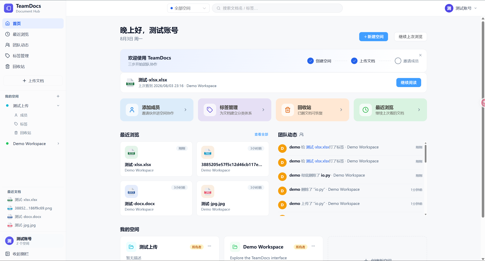
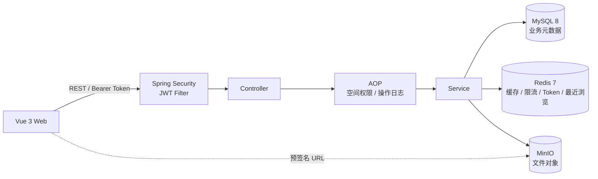
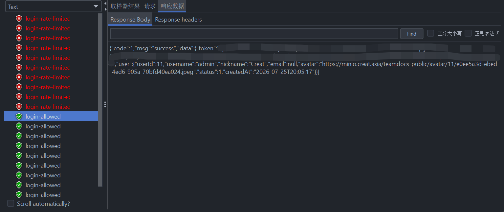
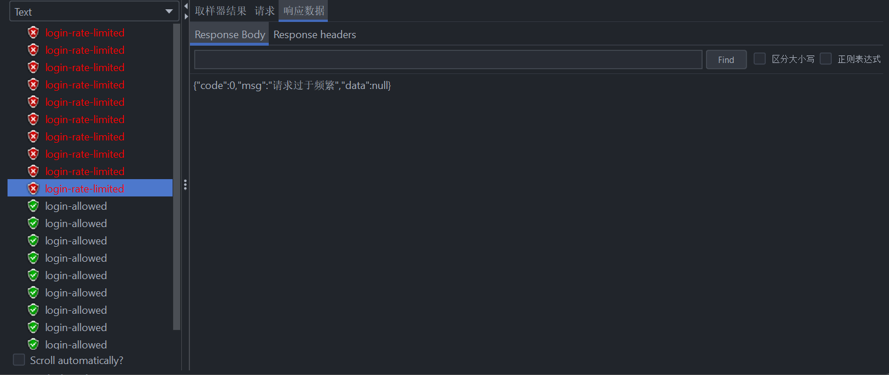

# TeamDocs

> 面向小型团队的文档协作平台。个人全栈项目，后端为重点，围绕认证授权、缓存与限流、对象存储和可测试的业务设计展开。

## 项目定位

小型团队的资料常分散在群聊、个人网盘和本地目录中，容易出现查找成本高、访问边界不清、讨论与文件脱节，以及误删后难以恢复等问题。TeamDocs 将文档管理与异步协作集中到一个团队工作台。

- **解决的问题**：通过独立空间和三级角色划分访问边界，使用目录、标签和元数据搜索组织资料，并以在线预览、评论、团队动态、最近浏览和回收站串联文档生命周期
- **应用场景**：适用于小型研发团队的技术资料库、课程或实验室小组的共享空间，以及项目交付材料和内部制度文档的集中管理
- **项目价值**：实现从身份认证、权限控制和文件存储，到检索、协作、审计与恢复的完整业务闭环，并通过自动化测试和容器化部署保证项目可验证、可运行

- **后端**：Java 17 / Spring Boot 3.5 / Spring Security / MyBatis-Plus
- **前端**：Vue 3 / Vite 6 / Element Plus
- **基础设施**：MySQL 8 / Redis 7 / MinIO / Docker Compose

<p align="center">
  
</p>

<p align="center"><sub>TeamDocs 工作台：空间、最近浏览与团队动态集中展示。</sub></p>

## 工程目标

在完成业务闭环之外，项目重点处理了以下后端工程问题：

- JWT 无状态认证下，如何支持当前 Token 注销和修改密码后旧 Token 失效
- 多个业务模块共用空间权限时，如何避免在 Service 中重复编写角色校验
- 文件存储在 MinIO 时，如何区分在线预览与下载，并处理浏览器可达地址和 CORS
- Redis 出现异常时，如何让缓存、限流和最近浏览尽量不影响核心业务
- 操作日志写入失败时，如何保留主业务结果

## 工程亮点

| 场景 | 设计与实现 | 验证重点 |
|---|---|---|
| 认证与 Token 失效 | Spring Security + JWT + BCrypt；Redis 保存 Token 撤销记录和用户失效时间水位 | JWT 解析、白名单、异常响应、单 Token 注销、用户全部 Token 失效 |
| 空间角色权限 | OWNER / ADMIN / MEMBER 三级角色；使用 `@RequireSpaceRole`、`@SpaceId` 和 AOP 统一完成成员与角色校验 | 非成员访问、角色边界、注解参数、`SpaceContext` 清理 |
| 文档存储与预览 | MinIO 私有桶保存文件；后端签发限时 URL，预览使用 `inline`，下载使用 `attachment` | 文件归属、预签名地址、公开端点、文件名编码和跨域访问 |
| Redis 能力 | Cache Aside 空间缓存、Lua 登录限流、ZSet 最近浏览；Redis 读写异常时降级 | 缓存命中/失效、限流窗口、Redis 故障隔离、最近浏览排序 |
| 审计与活动流 | 自定义注解 + AOP 记录资源、URI、耗时和执行结果；日志保存失败不覆盖主业务结果 | 成功/失败日志、资源定位、异常隔离 |

## 系统结构



请求首先经过 JWT Filter 完成身份认证，再由空间权限切面处理业务授权。Service 负责业务规则和事务边界；MySQL 保存结构化数据，Redis 承担可降级的辅助能力，MinIO 保存文件本体。浏览器通过预签名 URL 直接访问文件，后端不代理大文件流。

## 功能范围

- 用户注册、登录、退出登录、个人信息与密码修改
- 空间创建、成员管理和 OWNER / ADMIN / MEMBER 权限控制
- 文件夹分层管理与移动；文档上传、下载、移动、重命名、软删除和回收站恢复
- 标签管理、按标签筛选、MySQL FULLTEXT + ngram 元数据搜索
- 评论与回复、操作日志、团队活动流、最近浏览
- 图片、文本、PDF、Word、表格、演示文稿和 OFD 在线预览

## 质量与验证

当前后端包含 **16 个测试类、83 个 JUnit 测试用例**，主要覆盖：

- 用户注册登录、密码修改和 Token 撤销
- JWT Filter、统一 401 响应和空间角色切面
- 文档生命周期、评论权限、分页模型和标签业务
- Redis 缓存故障隔离、Lua 限流与最近浏览
- 操作日志成功、失败和异常隔离

服务器端 Docker 冒烟验收覆盖了健康检查、注册登录、空间创建、文件上传、预览 CORS、下载响应头、最近文档以及退出登录后的 Token 失效。

### JMeter 并发限流验证

使用 JMeter 在 1 秒内发起 20 次并发登录请求，验证 Redis Lua 固定窗口限流。结果为前 10 次登录进入正常认证流程，后 10 次被限流规则拒绝，符合当前阈值配置。

| 线程数 | Ramp-up | 每线程循环 | 正常处理 | 触发限流 |
|---:|---:|---:|---:|---:|
| 20 | 1 秒 | 1 | 10 | 10 |


<p align="center">
  
</p>

<p align="center">
  
</p>


本地验证命令：

```powershell
cd teamdocs-backend
.\mvnw.cmd test

cd ..\teamdocs-frontend
npm ci
npm run build
```

## 快速启动

前置条件：Docker 与 Docker Compose v2、Node.js 20+。

```powershell
# 1. 创建 Docker 环境文件，并替换其中的示例密钥
Copy-Item .env.docker.example .env.docker

# 2. 将 .env.docker 中的 BACKEND_PORT 改为 8080，
#    以匹配当前 Vite 开发代理，然后启动后端依赖与 API
docker compose --env-file .env.docker -f docker-compose.dev.yml up -d --build

# 3. 启动前端
cd teamdocs-frontend
npm ci
npm run dev
```

- Web：`http://localhost:5173`
- API：`http://localhost:8080`
- MinIO Console：`http://localhost:19001`

更完整的环境变量、接口和故障排查说明见 [后端文档](teamdocs-backend/README.md) 与 [前端文档](teamdocs-frontend/README.md)。

## 目录结构

```text
TeamDocs/
├── teamdocs-backend/    Spring Boot API、领域服务与测试
├── teamdocs-frontend/   Vue 3 Web 客户端
├── sql/                 数据库初始化与全文索引脚本
├── docker-compose.dev.yml
└── README.md
```

## 设计边界

- 当前定位是团队文档管理与异步协作，不包含多人实时协同编辑
- 搜索使用 MySQL ngram 全文索引，不提供语义检索
- JWT 已支持主动失效，但暂未实现 Access Token / Refresh Token 双 Token 体系
- 自动化测试以 Java 后端为主，前端目前依赖构建检查和人工回归
- 当前未接入 GitHub Actions，公开构建状态将在 CI 完成后补充
