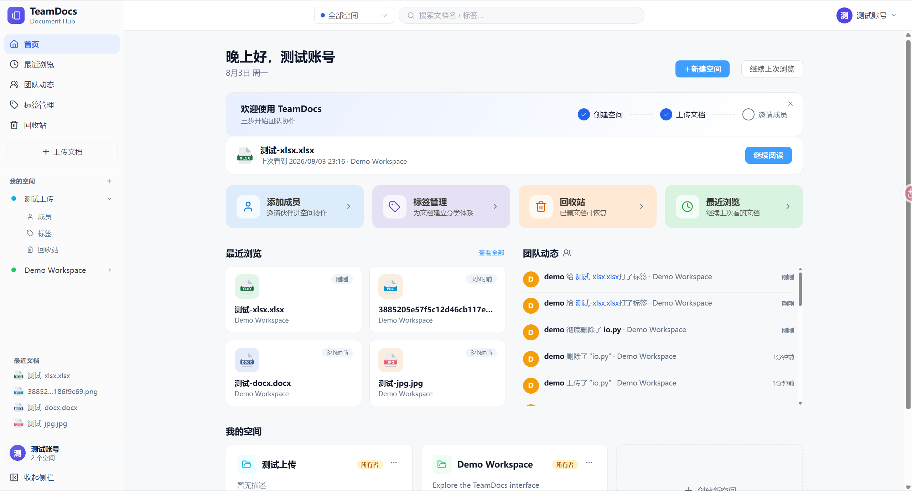
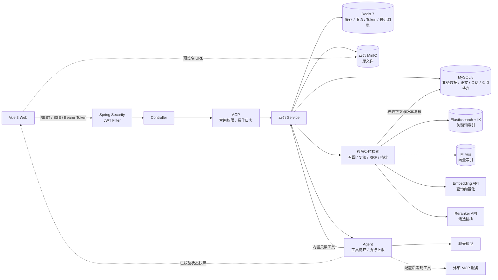
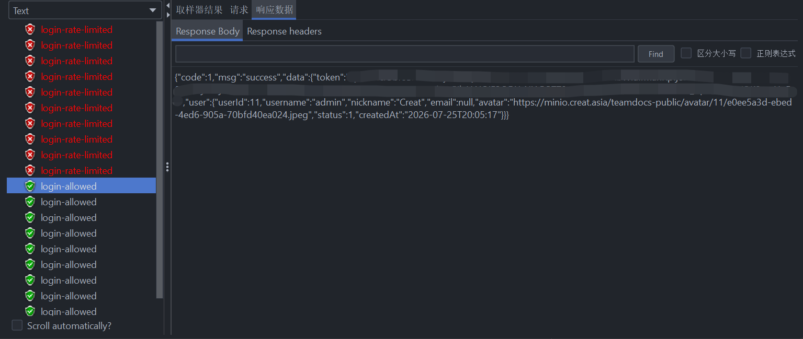
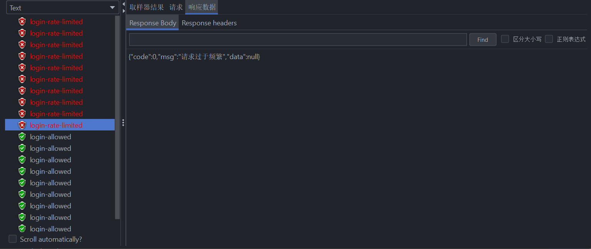

# TeamDocs

> 面向小型团队的 RAG 文档知识库与协作平台。结合 Elasticsearch 关键词检索、Milvus 向量召回和 Reranker 精排，通过 Agent 工具调用实现空间权限约束下的文档问答、多文档比较与来源追溯。

## 项目定位

小型团队的资料常分散在群聊、个人网盘和本地目录中，容易出现查找成本高、访问边界不清、讨论与文件脱节，以及误删后难以恢复等问题。TeamDocs 将文档管理、异步协作和基于团队资料的 RAG 问答集中到一个工作台。

RAG 不只依赖向量搜索：系统先检索当前用户有权访问的资料，再将有效正文提供给模型生成带来源的回答。Agent 可以根据工具结果继续查找或读取片段，而不是固定执行一次检索后直接总结。

- **解决的问题**：通过独立空间和三级角色划分访问边界，使用目录、标签和正文检索组织资料，通过带来源的只读问答查找信息，并以在线预览、评论、团队动态、最近浏览和回收站串联文档生命周期
- **应用场景**：适用于小型研发团队的技术资料库、课程或实验室小组的共享空间，以及项目交付材料和内部制度文档的集中管理
- **项目价值**：实现从身份认证、权限控制和文件存储，到检索、协作、审计与恢复的完整业务闭环，并通过自动化测试和隔离环境验证关键路径

- **后端**：Java 17 / Spring Boot 3.5 / Spring Security / MyBatis-Plus / LangChain4j
- **前端**：Vue 3 / Vite 6 / Element Plus
- **基础设施**：MySQL 8 / Redis 7 / MinIO / Elasticsearch 8.15.3（IK）/ Milvus 3.0.2 / Docker Compose
- **AI 接入**：OpenAI-compatible 聊天模型；示例使用硅基流动 `Qwen/Qwen3-Embedding-8B` 与 `Qwen/Qwen3-Reranker-8B`，地址和模型均显式配置，不设置默认或兜底供应商

<p align="center">
  
</p>

<p align="center"><sub>TeamDocs 工作台：空间、最近浏览与团队动态集中展示。</sub></p>

## 工程目标

在完成业务闭环之外，项目重点处理了以下后端工程问题：

- JWT 无状态认证下，如何支持当前 Token 注销和修改密码后旧 Token 失效
- 多个业务模块共用空间权限时，如何避免在 Service 中重复编写角色校验
- 文件存储在 MinIO 时，如何区分在线预览与下载，并处理浏览器可达地址和 CORS
- Redis 出现异常时，如何让缓存、限流和最近浏览尽量不影响核心业务
- 操作日志写入失败时，如何保留主业务结果
- 文档解析、重试和版本变化时，如何避免发布过期正文或返回失效引用
- 关键词与向量召回如何融合，重排前如何限制候选数量并复核资料出站权限
- 向量索引异步更新失败、文档删除或 Collection 切换时，如何补偿且不影响文档主业务
- 模型选择工具后，如何持续校验权限、约束执行次数，并安全处理取消和断线

## 工程亮点

| 场景 | 设计与实现 | 验证重点 |
|---|---|---|
| 认证与 Token 失效 | Spring Security + JWT + BCrypt；Redis 保存 Token 撤销记录和用户失效时间水位 | JWT 解析、白名单、异常响应、单 Token 注销、用户全部 Token 失效 |
| 空间角色权限 | OWNER / ADMIN / MEMBER 三级角色；使用 `@RequireSpaceRole`、`@SpaceId` 和 AOP 统一完成成员与角色校验 | 非成员访问、角色边界、注解参数、`SpaceContext` 清理 |
| 文档存储与预览 | MinIO 私有桶保存文件；后端签发限时 URL，预览使用 `inline`，下载使用 `attachment` | 文件归属、预签名地址、公开端点、文件名编码和跨域访问 |
| Redis 能力 | Cache Aside 空间缓存、Lua 登录限流、ZSet 最近浏览；旁路能力异常时降级，JWT 撤销校验异常时拒绝认证 | 缓存命中/失效、限流窗口、Redis 故障隔离、最近浏览排序 |
| 审计与活动流 | 自定义注解 + AOP 记录资源、URI、耗时和执行结果；日志保存失败不覆盖主业务结果 | 成功/失败日志、资源定位、异常隔离 |
| 正文解析与检索 | 后台提取 TXT、Markdown、文本 PDF 和 DOCX，按版本发布分块；ES 关键词检索回退 MySQL | 解析超时、重复任务、版本竞争、索引故障、检索边界 |
| 混合召回与重排 | ES 与 Milvus 分别召回候选，回 MySQL 复核后通过 RRF 融合，再由 Reranker 精排；最终最多返回 6 个片段 | 原始查询向量化、候选去重、空间/版本过滤、精排位置与故障降级 |
| 向量索引同步 | MySQL 持久化待办、任务代次、有界补扫与有限重试；模型、维度或 Collection 变化后重新索引 | 事务回滚、迟到任务、删除清理、初始版本 0、失败重试 |
| 文档 Agent | LangChain4j 原生工具调用与显式循环；内置文档工具只读，会话幂等、调用次数和上下文限制、来源校验 | 工具参数、空间边界、取消超时、用量记录、全部出站候选的依赖遮蔽 |
| 流式状态 | SSE 推送已提交且重新授权的运行快照，前端断线恢复观察而不重复提交 | 订阅竞争、Nginx 刷新、401、切换空间和旧事件丢弃 |

## 系统结构


```mermaid
flowchart LR
    Browser[Vue 3 Web] -->|REST / SSE / Bearer Token| Security[Spring Security<br/>JWT Filter]
    Security --> Controller[Controller]
    Controller --> Aspect[AOP<br/>空间权限 / 操作日志]
    Aspect --> Service[业务 Service]
    Service --> MySQL[(MySQL 8<br/>业务数据 / 正文 / 会话 / 索引待办)]
    Service --> Redis[(Redis 7<br/>缓存 / 限流 / Token / 最近浏览)]
    Service --> MinIO[(业务 MinIO<br/>原文件)]
    Service --> Retrieval[权限受控检索<br/>召回 / 复核 / RRF / 精排]
    Retrieval --> ES[(Elasticsearch + IK<br/>关键词索引)]
    Retrieval --> Milvus[(Milvus<br/>向量索引)]
    Retrieval --> Embedding[Embedding API<br/>查询向量化]
    Retrieval --> Reranker[Reranker API<br/>候选精排]
    Retrieval -->|权威正文与版本复核| MySQL
    Service --> Agent[Agent<br/>工具循环 / 执行上限]
    Agent --> Model[聊天模型]
    Agent -->|内置只读工具| Service
    Agent -. 配置后发现工具 .-> MCP[外部 MCP 服务]
    Agent -. 已校验状态快照 .-> Browser
    Browser -. 预签名 URL .-> MinIO
```

MySQL 是业务数据、正文和权限状态的事实来源；ES 与 Milvus 都是可重建的索引，命中结果必须回 MySQL 复核。后台根据持久化待办读取当前有效分块，调用 Embedding 后同步 Milvus；向量故障不阻断原有文档管理和关键词检索。Redis 的缓存、限流等旁路能力可降级，但撤销校验异常时拒绝认证。SSE 只发送运行状态与已校验结果，不发送模型原始 Token 或私有思维链。

## 功能范围

- 用户注册、登录、退出登录、个人信息与密码修改
- 空间创建、成员管理和 OWNER / ADMIN / MEMBER 权限控制
- 文件夹分层管理与移动；文档上传、下载、移动、重命名、软删除和回收站恢复
- 标签管理、按标签筛选、MySQL FULLTEXT + ngram 元数据搜索
- 评论与回复、操作日志、团队活动流、最近浏览
- 图片、文本、PDF、Word、表格、演示文稿和 OFD 在线预览
- TXT、Markdown、文本 PDF、DOCX 正文解析与 ES/MySQL 关键词检索
- Milvus 语义召回、RRF 排名融合、Reranker 精排与索引失败补偿
- 空间内文档问答、会话历史、工具状态、停止执行和来源预览
- 按配置接入外部 MCP 工具，不替代内置文档权限校验

## RAG 与文档 Agent

问候、能力介绍和必要的澄清直接回复，不触发文档检索；需要资料依据时，模型在当前用户和空间的权限范围内选择查找文档、检索正文、读取片段三个内置工具，完成单文档问答与多文档比较。页面提供会话历史、SSE 工具状态、停止和来源预览；回答通过来源校验，文档失效后相关历史回答会被遮蔽。

检索过程：

1. ES 与 Milvus 分别召回最多 20 个候选；关键词路径不足时由 MySQL 补齐。
2. 按当前空间、文档、删除状态和解析版本回 MySQL 复核，再去重并通过 RRF 合并排名。
3. 最多 20 个已授权片段交给 Reranker，最终返回最多 6 条，并继续受正文长度限制约束。
4. Agent 根据证据继续读取或生成带来源的回答。发送给重排模型的全部候选都纳入来源依赖，不只记录最终引用。

Embedding 或 Milvus 不可用时保留关键词检索；重排失败时保留融合排名。权限撤销、取消和超时不会作为普通故障被降级绕过。当前两路召回顺序执行，不宣称并行检索或已验证性能提升。

Agent、Embedding、Reranker 和 MCP 根据各自配置的有效 Key 自动启用，空值或占位值不触发外部调用，无须在环境模板中额外设置启用开关。**填写真实 Embedding Key 后，后台会为已有 READY 文档发送正文并建立向量索引**；填写前须确认资料出站范围。聊天、向量化和重排使用各自显式配置，失败时不自动切换供应商。

每用户同时最多一个 Agent 运行，每轮最多 6 次聊天模型调用、8 次工具调用、90 秒。内置文档工具只读；外部 MCP 工具的能力由所配置服务器决定，应单独审查，不能一概视为只读。

## 质量与验证

2026-10-01 已完成以下分组验证。各组可能重复覆盖用例，不能相加当作一次全量测试：

| 验证范围 | 结果 | 说明 |
|---|---|---|
| 后端离线回归 | 220 项中 216 通过、4 项当时跳过 | 4 项为显式启动 MySQL 的向量任务测试，随后单独执行通过；其他原有 Docker/在线模型集成测试未纳入这轮 |
| 真实 MySQL | 5 项全部通过 | 合并 `init.sql` 初始化、向量待办事务回滚、任务代次、有限重试和删除清理 |
| 真实 Milvus 3.0.2 | 1 项集成测试通过 | 独立 Milvus/etcd/MinIO 容器验证集合创建、写入、空间/文档过滤、初始版本 0、检索和删除 |
| 实际 Embedding / Reranker API | 2 项全部通过 | 仅使用固定合成文字，验证向量维度、相关性及重排索引，不读取业务文档或打印 Key |
| 部署配置回归 | 3 项通过 | 单一初始化挂载、语义服务 profile、提交 SHA 与手动评估配置 |
| 后端打包与静态检查 | 通过 | JAR 打包、基础/semantic Compose 配置及 `git diff --check` |

### JMeter 并发限流验证

使用 JMeter 在 1 秒内发起 20 次并发登录请求，验证 Redis Lua 固定窗口限流。结果为前 10 次登录进入正常认证流程，后 10 次被限流规则拒绝，符合当前阈值配置。

| 线程数 | Ramp-up | 每线程循环 | 正常处理 | 触发限流 |
|---:|---:|---:|---:|---:|
| 20 | 1 秒 | 1 | 10 | 10 |


<p align="center">
  
</p>

<p align="center">
  
</p>


以下命令用于源码验证，不属于服务器部署步骤；后端需要 Java 17、Docker 和可用的测试镜像，前端需要 Node.js 22.15+。

```bash
docker build -t teamdocs-elasticsearch:8.15.3 docker/elasticsearch

cd teamdocs-backend
mvn '-Dtest=*,!AgentEvaluationTest' -Dteamdocs.test.vector-sql=true test

cd ../teamdocs-frontend
npm ci
npm test
npm run build
```

## 快速启动

前置条件：Docker 与 Docker Compose v2，以及已由 GitHub Actions 成功发布、当前机器可拉取的镜像。服务器不需要安装 Java、Node.js 或 Maven。

**部署验收边界：**Milvus、etcd 和向量专用 MinIO 镜像已拉取并在隔离测试中运行通过，但完整 Compose 尚未验收。业务桶初始化使用的固定 `minio/mc` 镜像在 2026-09-29 验证中曾拉取失败，本轮没有复验该镜像；首次部署前仍需确认所有镜像可获取，见 [部署文档](docs/DEPLOYMENT.md)。

以下命令在仓库根目录执行；已有 `.env` 不要覆盖：

```bash
cp -n .env.example .env
# 编辑 .env：将 IMAGE_TAG 换成已发布的完整提交 SHA，填写基础服务凭据和文件访问地址
# 暂不启用模型时，保留相关 API Key 为空或占位；不要把真实密钥提交到仓库
docker compose config --quiet
docker compose pull
docker compose up -d --wait
docker compose ps
```

- 本机 Web：按当前模板为 `http://localhost:15173`，由 `WEB_PORT` 控制
- 本机 API：`http://127.0.0.1:8080`，由 `BACKEND_PORT` 控制
- 本机 MinIO S3 API / Console：`http://127.0.0.1:29000` / `http://127.0.0.1:29001`

根目录保留一份 `docker-compose.yaml`。空库首次启动只挂载 `sql/init.sql`，按用户、空间、文档、评论、日志、全文索引、正文、Agent、向量待办的顺序初始化；已有数据目录不会重新执行。`minio-init` 负责创建业务存储桶，禁止通过重跑初始化或 `down -v` 处理更新问题。

`MINIO_PUBLIC_ENDPOINT` 填写浏览器可访问的文件地址；Compose 中后端通过容器网络访问 MinIO，原生 IDEA 后端使用 `MINIO_ENDPOINT`。`MINIO_CORS_ALLOWED_ORIGIN` 必须与实际前端来源一致，修改 `WEB_PORT`、域名或 HTTPS 时同步调整。首次镜像发布权限和远程接入见 [部署文档](docs/DEPLOYMENT.md)。

### 启用 Milvus 与混合检索

确认内存、磁盘和端口可用，填写向量专用存储凭据后，先启动语义服务：

```bash
docker compose --profile semantic pull milvus milvus-etcd milvus-storage
docker compose --profile semantic up -d --wait milvus
```

该命令只启动 Milvus 及其两个依赖，不会默认启动或替换基础服务。向量专用 MinIO 使用独立数据卷，不复用业务文件存储；etcd 和向量存储不映射宿主机端口。Milvus API / 健康检查默认分别为 `127.0.0.1:19530` / `127.0.0.1:9091`。

准备好向量任务表后，在 `.env` 中填写 Embedding/Reranker 的地址、模型和有效 Key，再按实际启动方式重新加载后端。已有数据库须审核后单独补充 `sql/vector_index.sql` 的新表，不能重新执行含 DROP 的 `init.sql`。原生后端使用 `MILVUS_URL=http://127.0.0.1:19530`；Compose 后端使用容器内地址。

完整启用语义服务的部署和后续更新使用同一 profile：

```bash
docker compose --profile semantic up -d --wait
```

模型服务故障不会自动切换到其他供应商；向量召回和重排可以降级到现有关键词或融合结果。

### CI/CD 与更新

[GitHub Actions](.github/workflows/ci.yml) 在 Pull Request 和 `main` 提交时校验 Compose、一次性运行后端普通测试（含向量 SQL）与前端测试并构建前端；固定检索评估仅在手动运行时勾选 `run_retrieval_evaluation` 执行，不调用真实模型。`main` 普通校验通过后构建并发布前后端及 Elasticsearch GHCR 镜像，使用同一完整提交 SHA 标记版本，同时更新 `latest`；手动评估模式不发布镜像。生产 Compose 要求显式填写 `IMAGE_TAG`，不再隐式回退到 `latest`。CI 负责测试和镜像交付，服务器由维护者执行 Compose 更新，不自动通过 SSH 部署。

等待目标版本的 CI 全部成功，将 `.env` 中的 `IMAGE_TAG` 改为该次发布的完整提交 SHA，再执行（启用语义服务时，两条命令都使用 `docker compose --profile semantic`）：

```bash
docker compose pull
docker compose up -d --wait
```

回退应用时改回上一次的 SHA 并执行相同命令。配置或 SQL 变更需同步对应版本的仓库文件；应用回退不等于数据库回退。基础设施镜像与表结构需单独核对兼容性，数据保存在命名卷中；更新无需 `down`，不要使用 `down -v` 删除数据。

## 目录结构

```text
TeamDocs/
├── .github/workflows/ci.yml
├── teamdocs-backend/    Spring Boot API、解析、混合检索、Agent 与测试
├── teamdocs-frontend/   Vue 3 工作台与文档问答页面
├── sql/                 init.sql 空库入口及分项初始化/测试脚本
├── docker/elasticsearch/ Elasticsearch 与 IK 镜像
├── docs/                部署说明与运行截图
├── docker-compose.yaml
├── .env.example
└── README.md
```

## 设计边界

- 当前定位是团队文档管理、异步协作与 RAG 问答，不包含多人实时协同编辑；内置文档工具不开放写操作，外部 MCP 能力需另行审查
- 正文检索保留 ES 关键词索引与 MySQL ngram 回退；Milvus 和 Reranker 已通过真实小样本接口验证，混合检索的整体收益仍需四路对照评测
- 后端正文解析不包含 OCR，也不等于支持所有前端可预览格式
- JWT 已支持主动失效，但暂未实现 Access Token / Refresh Token 双 Token 体系
- 前端已有状态与流协议自动化测试，混合检索下的完整交互仍需浏览器回归；固定集检索成绩不等于真实模型回答质量
- 采用单机 Compose 和单后端进程，不提供高可用、滚动发布或分布式索引任务租约
