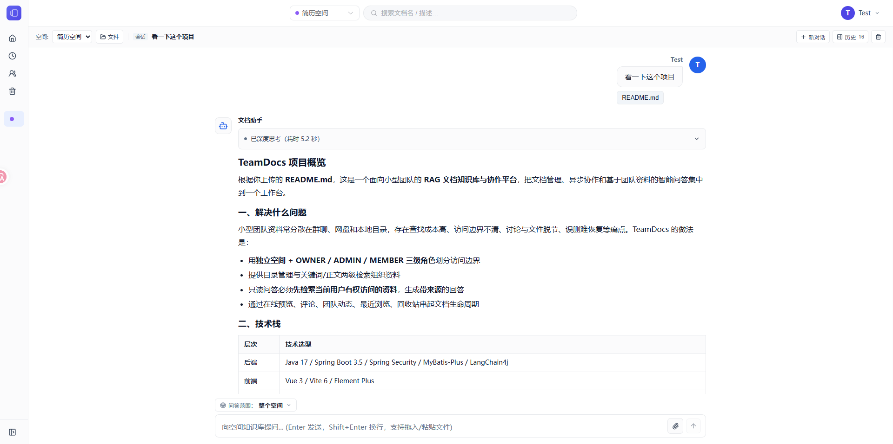
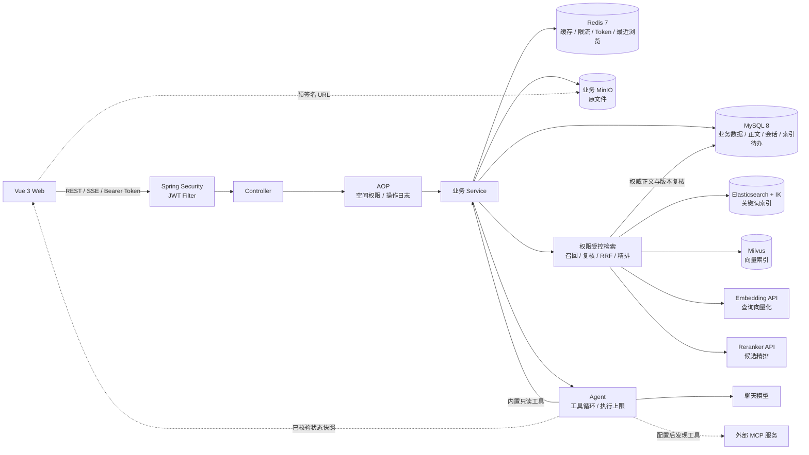

# TeamDocs

> 面向小型团队的文档知识库与 AI 问答平台。基于 Spring Boot、Vue 3 和 LangChain4j，结合 Elasticsearch、Milvus 与 Reranker，实现空间权限约束下的文档管理、混合检索和引用溯源。

## 项目背景

研发团队、课程小组和项目交付团队的资料往往分散在群聊、网盘与本地目录中。文件可以保存下来，但正文难以定位、成员访问边界不清，讨论也容易与具体文档脱节。

直接接入大模型并不能解决这些问题：模型不知道哪些资料属于当前团队，也无法仅凭回答证明信息来源；文档删除、版本更新或成员退出后，旧内容还可能继续留在检索索引与对话中。

TeamDocs 围绕这些场景，将文档管理、团队协作和基于资料的问答放进同一个工作台，让检索和回答遵循业务系统的权限与文档生命周期。

## 建设目标

- **统一资料入口**：用空间与文件夹组织文档，串联上传、预览、评论、移动、删除和恢复。
- **明确访问边界**：以空间成员和角色为依据，统一约束普通接口、文档检索、Agent 工具与引用访问。
- **让回答有据可查**：支持正文检索、多文档比较和多轮工具调用，回答关联实际读取的文档片段。
- **让系统可维护**：分离业务数据与可重建索引，提供索引状态、单文档修复、依赖检测和可追溯的容器交付方式。

## 关键实现

### 技术栈

| 层次 | 技术选型 |
|---|---|
| 后端 | Java 17、Spring Boot 3.5、Spring Security、MyBatis-Plus |
| 前端 | Vue 3、Vite 6、Element Plus、Pinia |
| Agent | LangChain4j、OpenAI-compatible 模型接口、SSE、MCP |
| 数据与存储 | MySQL 8、Redis 7、MinIO |
| 检索 | Elasticsearch 8.15.3（IK）、Milvus 3.0.2、Embedding、Reranker |
| 部署 | Docker Compose、GitHub Actions、GHCR |

聊天、向量化和重排分别配置模型地址、模型名称与密钥，不自动切换供应商。向量模型示例采用硅基流动 `Qwen/Qwen3-Embedding-8B`，重排示例采用 `Qwen/Qwen3-Reranker-8B`。

### 1. 将权限校验贯穿业务与问答

- 使用 Spring Security、JWT 和 BCrypt 完成身份认证；通过 Redis 撤销记录和用户失效时间水位支持退出登录、改密后旧 Token 失效。
- 使用 OWNER / ADMIN / MEMBER 三级角色，以 `@RequireSpaceRole`、`@SpaceId` 和 AOP 统一校验空间权限，避免各 Service 重复实现鉴权。
- 检索结果、模型出站资料和引用回看均复核空间归属、删除状态与文档版本；权限失效时不以普通服务降级绕过检查。

### 2. 建立完整的文档生命周期

- 文档原件存入 MinIO 私有桶，业务元数据保存在 MySQL；由后端签发限时访问地址，区分预览与下载。
- 同目录上传重名文件时自动加编号，保留两份，不默认覆盖已有文档。
- 提供文件夹管理、文档移动和重命名、评论回复、团队动态、最近浏览与回收站恢复。
- 后台解析按任务版本发布正文分块，避免迟到任务覆盖新版本；索引更新与文档主业务解耦。

### 3. 组合关键词与语义检索

检索不是直接把向量库结果交给模型，而是经过业务权限复核后再组织证据：

1. Elasticsearch 与 Milvus 分别召回关键词、语义候选，关键词路径不足时由 MySQL FULLTEXT + ngram 补齐。
2. 回 MySQL 核对空间、文档版本和删除状态，过滤无权访问或已经失效的片段。
3. 对有效候选去重并通过 RRF 融合排名，再由 Reranker 精排。
4. 将有限数量的正文片段提供给 Agent，保留文档、分块和位置标识，供后续引用校验与原文回看。

Embedding 或 Milvus 不可用时保留关键词检索，重排失败时保留融合排名。向量任务通过持久化待办、任务代次和有限重试处理失败补偿；用户可在文档详情中查看索引状态并发起修复。

### 4. 用显式循环组织 Agent 执行

问候、能力介绍和必要澄清直接回复；需要文档依据时，由模型选择工具，后端执行后再把结果交回模型。

```text
用户提问 → 模型选择工具 → 后端鉴权与执行 → 返回证据 → 模型继续检索或生成回答
```

| 能力 | 当前实现 |
|---|---|
| 工具调用 | 搜索空间文档、检索正文片段、读取正文分块；按配置发现外部 MCP 工具 |
| 多轮执行 | 显式维护模型与工具循环，限制调用次数和运行时间，执行中持续检查权限与取消状态 |
| 上下文管理 | 按模型可用输入容量保留最近完整问答，放不下时裁剪最旧轮次，不生成会话摘要 |
| 来源追溯 | 回答关联实际读取的片段，同一文件使用文件级编号；资料失效后遮蔽受影响的历史回答 |
| 运行状态 | QUEUED → RUNNING → SUCCEEDED / FAILED / CANCELLED / TIMED_OUT，工具阶段通过事件表达 |
| 取消与重连 | 中断当前模型 HTTP 请求，阻止后续执行与回答发布；断线后恢复观察，不重复提交任务 |

原始聊天记录不会因为上下文裁剪而删除；当前问题、附件及本轮工具调用链不拆开裁剪。普通问答不主动指定 `max_tokens`，但模型自身窗口、最大输出及应用安全限制仍然有效，配置见[部署文档](docs/DEPLOYMENT.md#问答输出与上下文预算)。

### 5. 支持附件问答与个人配置

- 对话附件支持常见文本、PDF、DOCX、XLSX、PPTX 与图片：文档先提取文本，图片交给支持视觉的当前模型，不自动写入空间索引。
- 可通过文件或文件夹限定问答范围，并对回答提交反馈。
- 用户可以配置自己的模型、测试连通性并查看依赖状态；个人密钥加密保存，运行使用配置快照。
- 用户启用全局记忆后，可抽取和管理长期偏好；它与会话历史分开，不充当对话摘要或文档事实来源。

### 6. 控制故障影响范围

- Redis 承担 Cache Aside 缓存、Lua 登录限流与 ZSet 最近浏览；可降级的旁路功能不阻断核心业务，Token 撤销校验异常则拒绝认证。
- 操作日志通过独立事务记录，日志写入失败不覆盖主业务结果。
- MySQL 保留业务事实，Elasticsearch 和 Milvus 作为可重建索引；异步索引失败不回滚已完成的文档操作。
- GitHub Actions 负责检查、构建和发布镜像，Compose 负责单机部署；应用镜像以完整提交 SHA 对齐版本。

## 项目成果

- **形成文档到答案的完整链路**：用户可以在同一工作台完成资料上传、组织、预览、讨论、检索与问答，并从引用返回原文。
- **将 AI 能力纳入既有权限体系**：问答不另建一套脱离业务数据的权限规则，文件范围、成员身份与文档版本共同决定可用证据。
- **提供可组合的问答方式**：空间文档、当前附件、个人模型与用户偏好分别承担不同职责，不把所有信息都混成长期会话上下文。
- **保留可维护的运维入口**：文档索引可以查看和修复，依赖状态可以检测，数据库与文件数据可独立保留，应用按镜像版本更新。

## 界面预览

<p align="center">
  
</p>

<p align="center"><sub>TeamDocs 工作台：空间、最近浏览与团队动态集中展示。</sub></p>


<p align="center">
  
</p>

<p align="center"><sub>TeamDocs agent：AI 功能展示</sub></p>

## 系统结构


```mermaid
flowchart LR
    Browser[Vue 3 Web] -->|REST / SSE / Bearer Token| Security[Spring Security<br/>JWT Filter]
    Security --> Controller[Controller]
    Controller --> Aspect[AOP<br/>空间权限 / 操作日志]
    Aspect --> Service[业务 Service]
    Service --> MySQL[(MySQL 8<br/>业务数据 / 正文 / 会话 / 索引待办)]
    Service --> Redis[(Redis 7<br/>缓存 / 限流 / Token / 最近浏览)]
    Service --> MinIO[(业务 MinIO<br/>原文件)]
    Service --> Retrieval[权限受控检索<br/>召回 / 复核 / RRF / 精排]
    Retrieval --> ES[(Elasticsearch + IK<br/>关键词索引)]
    Retrieval --> Milvus[(Milvus<br/>向量索引)]
    Retrieval --> Embedding[Embedding API<br/>查询向量化]
    Retrieval --> Reranker[Reranker API<br/>候选精排]
    Retrieval -->|权威正文与版本复核| MySQL
    Service --> Agent[Agent<br/>工具循环 / 执行上限]
    Agent --> Model[聊天模型]
    Agent -->|内置只读工具| Service
    Agent -. 配置后发现工具 .-> MCP[外部 MCP 服务]
    Agent -. 已校验状态快照 .-> Browser
    Browser -. 预签名 URL .-> MinIO
```

MySQL 是业务数据、正文和权限状态的事实来源；ES 与 Milvus 都是可重建的索引，命中结果必须回 MySQL 复核。后台根据持久化待办读取当前有效分块，调用 Embedding 后同步 Milvus；向量故障不阻断原有文档管理和关键词检索。Redis 的缓存、限流等旁路能力可降级，但撤销校验异常时拒绝认证。SSE 推送运行状态、工具进度和回答结果；断线后恢复观察，不重复提交同一次任务。

## 快速启动

前置条件：Docker 与 Docker Compose v2，以及已由 GitHub Actions 成功发布、当前机器可拉取的镜像。服务器不需要安装 Java、Node.js 或 Maven。

MinIO 和 mc 使用[固定摘要镜像](docs/DEPLOYMENT.md#minio-镜像来源)，应用镜像由 GitHub Actions 发布。已有数据升级前先备份，按[部署文档](docs/DEPLOYMENT.md)补充适用迁移，不重跑空库初始化脚本。

以下命令在仓库根目录执行；已有 `.env` 不要覆盖：

```bash
cp -n .env.example .env
# 编辑 .env：将 IMAGE_TAG 换成已发布的完整提交 SHA，填写基础服务凭据和文件访问地址
# 暂不启用模型时，保留相关 API Key 为空或占位；不要把真实密钥提交到仓库
docker compose config --quiet
docker compose pull
docker compose up -d --wait
docker compose ps
```

- 本机 Web：按当前模板为 `http://localhost:15173/login `，由 `WEB_PORT` 控制；访问 `/` 自动跳转到 `/login`，登录成功后进入 `/home` 工作台
- 本机 API：`http://127.0.0.1:8080`，由 `BACKEND_PORT` 控制
- 本机 MinIO S3 API / Console：`http://127.0.0.1:29000` / `http://127.0.0.1:29001`

根目录按用途拆分：`docker-compose.yaml` 为完整部署，`docker-compose.dev.yaml` 为独立的 IDEA 开发 ES/Milvus 服务，`docker-compose.semantic.yaml` 为可选 Milvus 服务。空库首次启动只挂载 `sql/init.sql`，按用户、空间、文档、评论、日志、全文索引、正文、Agent、向量待办的顺序初始化；已有数据目录不会重新执行。`minio-init` 负责创建业务存储桶，禁止通过重跑初始化或 `down -v` 处理更新问题。

如果复用已有 MySQL、Redis 或 MinIO，需同时调整 Compose 中后端的固定连接地址及相应服务依赖，不能只修改 `.env`。已有数据库卷中的密码不会随环境变量变化而自动更新。

`MINIO_PUBLIC_ENDPOINT` 填写浏览器可访问的文件地址；Compose 中后端通过容器网络访问 MinIO，原生 IDEA 后端使用 `MINIO_ENDPOINT`。`MINIO_CORS_ALLOWED_ORIGIN` 必须与实际前端来源一致，修改 `WEB_PORT`、域名或 HTTPS 时同步调整。首次镜像发布权限和远程接入见 [部署文档](docs/DEPLOYMENT.md)。

### IDEA 本地开发

只启动 ES、Milvus 及其必需的 etcd、专用对象存储，不启动 MySQL、Redis、业务 MinIO 或前后端，也不要求填写 `IMAGE_TAG`：

```bash
docker compose -f docker-compose.dev.yaml up -d --wait
```

首次启动会构建本地 Elasticsearch 镜像，需要保留 `docker/elasticsearch/`。开发文件仅发布 ES `9200`、Milvus `19530` 和健康端口 `9091` 到本机，由 `ES_PORT`、`MILVUS_PORT`、`MILVUS_HEALTH_PORT` 控制。MySQL、Redis、业务 MinIO 使用已有服务，在 `.env` 配置对应地址。IDEA 后端使用 `.env` 中的本机地址；部署文件覆盖为容器服务名和固定容器端口。若修改 `ES_PORT`，同步调整 `ES_URL`。MinIO CORS 应填写实际前端来源（Vite 通常为 `http://localhost:5173`）。

前端通过 `npm run dev` 启动后，默认访问 `http://localhost:5173/login`

**注意：`docker compose up` 启动完整应用；IDEA 开发单独使用 `-f docker-compose.dev.yaml`，不要与主文件合并。** 项目名 `teamdocs`、服务名和数据卷名保持不变；更新、查看状态和停止时使用启动时同一组 `-f` 参数。不删除数据卷、不加 `--remove-orphans`。

### 启用 Milvus 与混合检索

确认内存、磁盘和端口可用，填写向量专用存储凭据后，先启动语义服务：

```bash
docker compose -f docker-compose.dev.yaml pull milvus milvus-etcd milvus-storage
docker compose -f docker-compose.dev.yaml up -d --wait milvus
```

该命令只启动 Milvus 及其两个依赖，不会默认启动或替换基础服务。向量专用 MinIO 使用独立数据卷，不复用业务文件存储；etcd 和向量存储不映射宿主机端口。Milvus API / 健康检查默认分别为 `127.0.0.1:19530` / `127.0.0.1:9091`。

准备好向量任务表后，在 `.env` 中填写 Embedding/Reranker 的地址、模型和有效 Key，再按实际启动方式重新加载后端。已有数据库须审核后单独补充 `sql/vector_index.sql` 的新表，不能重新执行含 DROP 的 `init.sql`。原生后端使用 `MILVUS_URL=http://127.0.0.1:19530`；Compose 后端使用容器内地址。

完整启用语义服务的部署和后续更新使用同一组文件：

```bash
docker compose -f docker-compose.yaml -f docker-compose.semantic.yaml up -d --wait
```

模型服务故障不会自动切换到其他供应商；向量召回和重排可以降级到现有关键词或融合结果。

### CI/CD 与更新

[GitHub Actions](.github/workflows/ci.yml) 在 Pull Request 和 `main` 提交时校验 Compose、一次性运行后端普通测试（含向量 SQL）与前端测试并构建前端；固定检索评估仅在手动运行时勾选 `run_retrieval_evaluation` 执行，不调用真实模型。`main` 普通校验通过后构建并发布前后端及 Elasticsearch GHCR 镜像，使用同一完整提交 SHA 标记版本，同时更新 `latest`；手动评估模式不发布镜像。生产 Compose 要求显式填写 `IMAGE_TAG`，不再隐式回退到 `latest`。CI 负责测试和镜像交付，服务器由维护者执行 Compose 更新，不自动通过 SSH 部署。

等待目标版本的 CI 全部成功，将 `.env` 中的 `IMAGE_TAG` 改为该次发布的完整提交 SHA，再执行（启用语义服务时，两条命令都使用 `docker compose -f docker-compose.yaml -f docker-compose.semantic.yaml`）：

```bash
docker compose pull
docker compose up -d --wait
```

回退应用时改回上一次的 SHA 并执行相同命令。配置或 SQL 变更需同步对应版本的仓库文件；应用回退不等于数据库回退。基础设施镜像与表结构需单独核对兼容性，数据保存在命名卷中；更新无需 `down`，不要使用 `down -v` 删除数据。

## 目录结构

```text
TeamDocs/
├── .github/workflows/ci.yml
├── teamdocs-backend/    Spring Boot API、解析、混合检索、Agent 与测试
├── teamdocs-frontend/   Vue 3 工作台与文档问答页面
├── sql/                 init.sql 空库入口及分项初始化/测试脚本
├── docker/elasticsearch/ Elasticsearch 与 IK 镜像
├── docs/                部署说明与运行截图
├── docker-compose.yaml
├── docker-compose.dev.yaml
├── docker-compose.semantic.yaml
├── .env.example
└── README.md
```

## 设计边界

- 当前定位是团队文档管理、异步协作与 RAG 问答，不包含多人实时协同编辑。
- 内置文档工具只读，尚未实现 Agent 创建或修改文档；外部 MCP 能力由所配置服务器决定，需要单独审查。
- 当前不做模型摘要压缩，容量不足时模型会看不到被裁剪的旧轮次；限定范围或附件提问不混入普通历史。
- 前端可预览的格式不等于后台都能解析和建立索引；对话附件只绑定本次问答，不自动复用旧附件。
- 两路检索目前顺序执行，索引更新为异步过程，文档创建成功不代表已经可以检索。
- 当前采用单机 Compose 和单后端进程，未提供多实例高可用与滚动发布能力。
